## 前置き

動画編集ソフトってたくさんありますよね、正直何使えばいいかわからないし、PCで動画編集するの少し複雑な印象がありますよね。

そんな時簡単にぱぱっと編集できるソフトがあると便利ですよね。

今回は簡単なGUIで使えるソフト

[Minitool movie maker](https://moviemaker.minitool.com/) について紹介していきます!

## Minitool MovieMakerとは？

Minitool社のソフトになります！

動画編集用のソフトでリソースが豊富です！

また後から紹介しようとは思いますが、

なによりカメラの移動モーション、トランジション、エフェクトの種類の多さが凄いよいポイントですね！

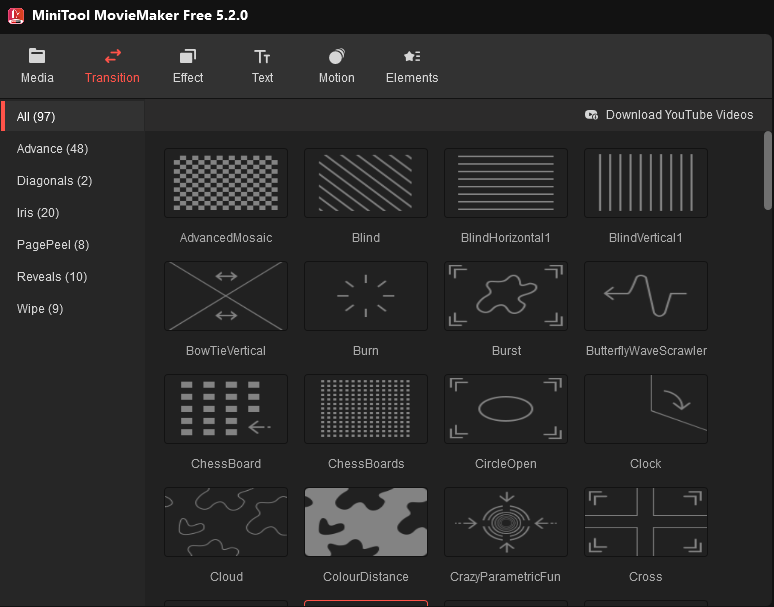

現段階ではまだ日本語に未対応なようです....すこしここはネックかもしれません。

だけれど中学レベルの英語がわかれば大丈夫だと思います！！

ちなみに一応、無料版と有料版があります。

## 料金プラン

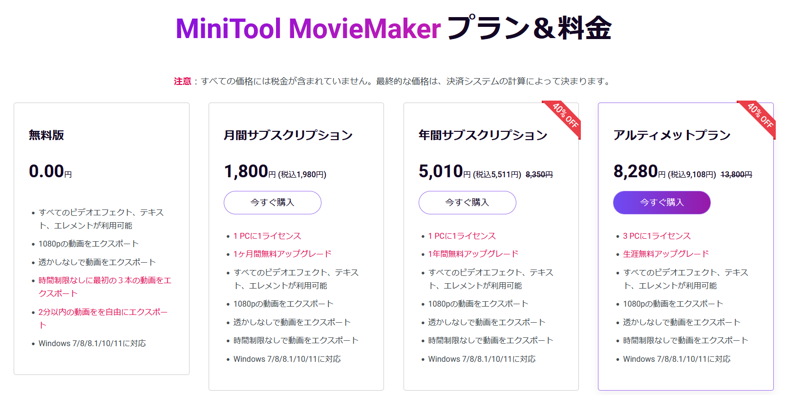

値段はこのようになっています！

正直かなり動画を編集しない限りは無料版で問題ないと思われます！

たくさんのデバイスで使いたくなったら、アルティメットプランでもいいかもですね！

## ダウンロード・インストール

ダウンロードは[こちらから](https://moviemaker.minitool.com/)!

インストーラーを開いたらインストールを押すだけです！

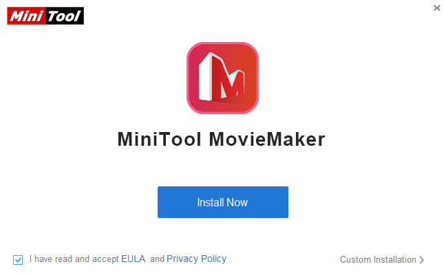

## 使い方

まず、ソフトを起動します！

そしたら、NEW Projectを選択し、新しいプロジェクトを作成します。

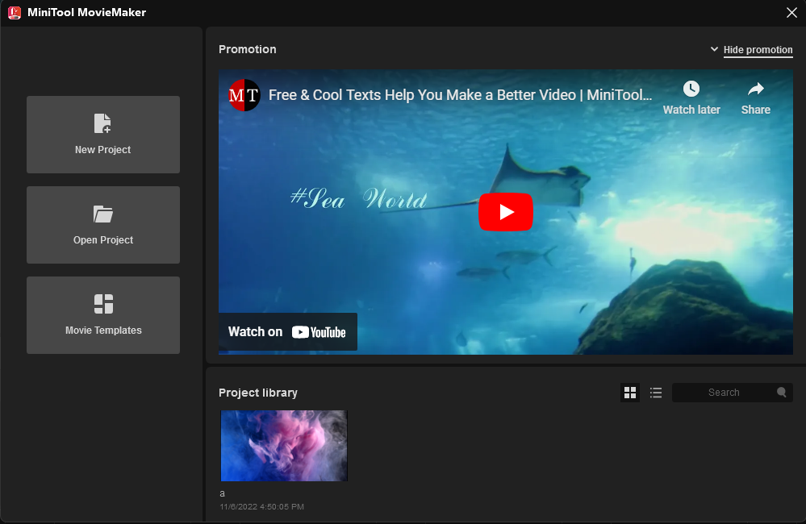

そしたら素材となる動画をMediaのところにドラッグ＆ドロップするか、"import media file"から動画を持ってきます

次に、画面下部にあるタイムラインドラッグでに動画を入れていきます！

ここからは、それぞれのやり方について詳しく説明していこうと思います！

### 基本的なカットの方法

①青い軸をカットしたい所に持っていきます
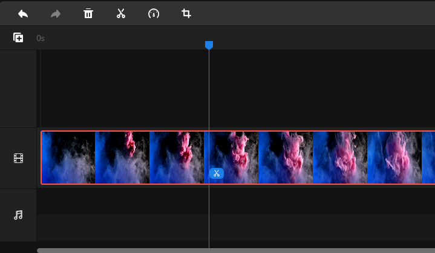

②左上のカットボタンをクリックしQuic splitを選択します
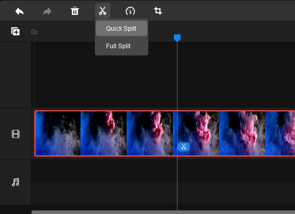

これで動画がカットできます！
すごく簡単ですね！

### トランジションのやり方

①左上のtransitionのところから使いたいものを選びます
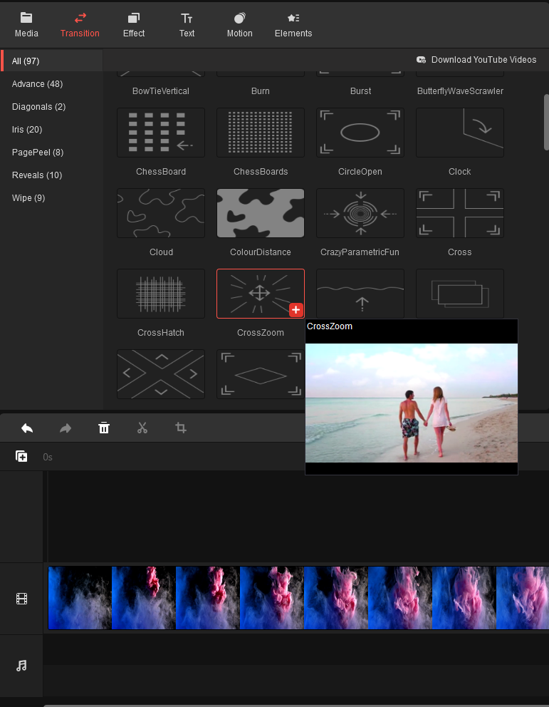

②クリップの切れ目にドラッグします
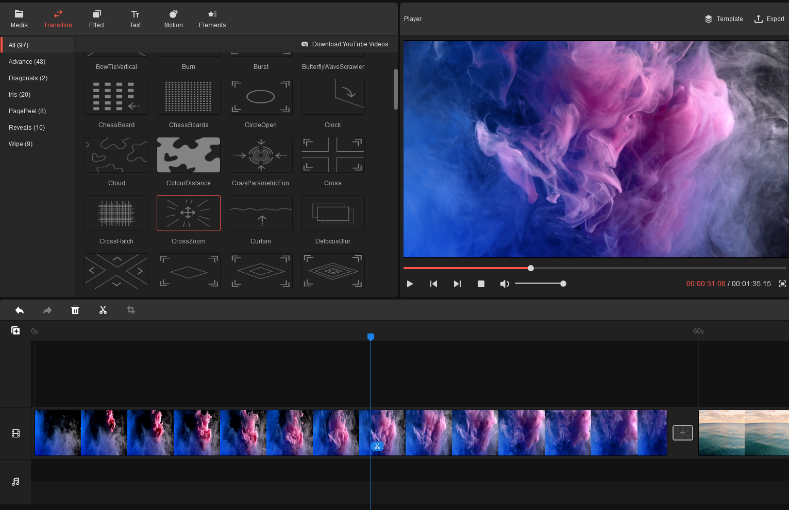

これでトランジションをつけることができました！

### モーションの追加方法

モーションは区切られた１クリップに適用するような形になっています。

①まず、左上motion欄から使いたいものを選びます
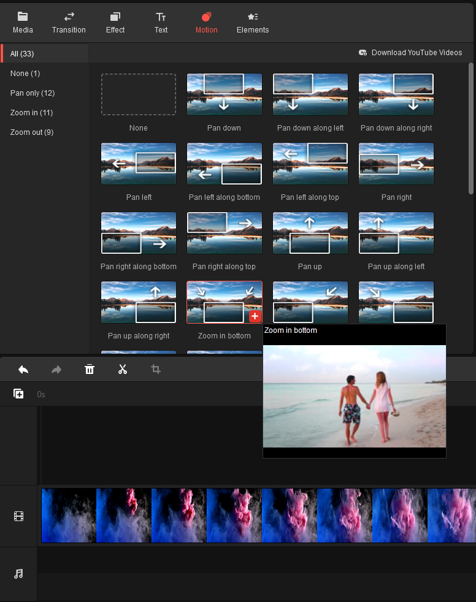

②クリップにドラッグします

↓のように右上がなっていれば適用ができている状態です！
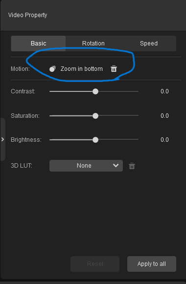

### エクスポートの方法

①中央の部分にあるPlayerの横のExportをクリックします
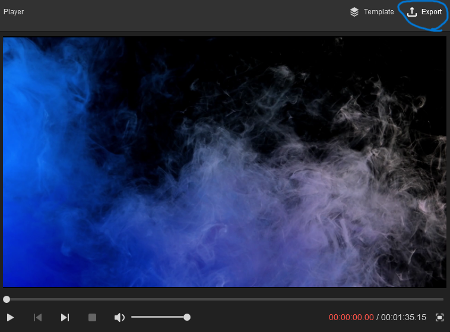

②基本的にはそのままの設定でExportを再度クリックすると
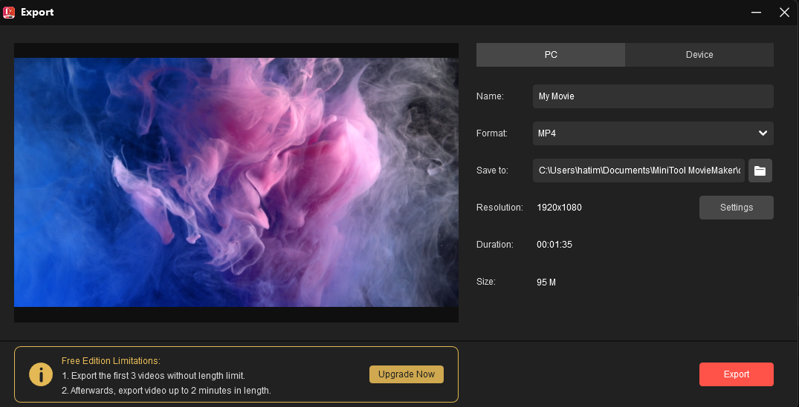

そうするとC:\Users\xxx\Documents\MiniTool MovieMaker\output\My Movie.mp4にエクスポートされます！

※xxxはユーザー名

## まとめ

このソフト、[Minitool movie maker](https://moviemaker.minitool.com/)　はどうでしたか？

すごく直感的に操作しやすく、PCでの動画編集のハードルが下がったのではないのかなと感じました！

皆さんもぜひ使ってみては？

最後まで見ていただきありがとうございました！

